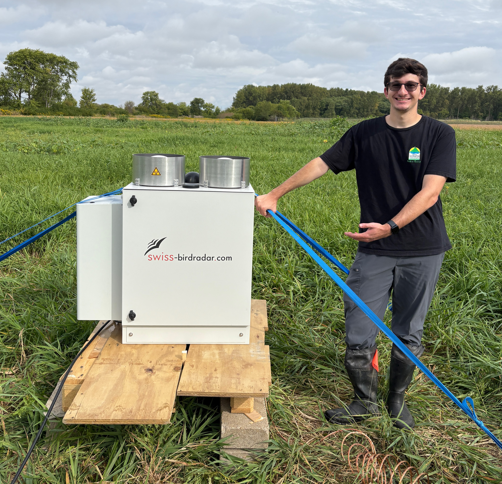

I'm a graduate student at the University of Illinois Urbana Champaign in the **[Migration Biology Lab](https://www.migrationbiology.org/)**. I use cutting-edge tools like fine-scale radar, bioacoustics, and thermal imaging to explore the social and spatial components of nocturnal migration. I'm especially interested in understanding the function of nocturnal flight calls, inter- and intraspecific interactions in migration, and how human landscapes impact migratory behavior. In this, I hope to connect individual behavior to large-scale migration patterns and expand our knowledge of migration while improving how we study it.

Outside of my research, I am an avid [birder](https://ebird.org/profile/MTE3Mjc1Mw) and [photographer](https://masonmaronphotography.myportfolio.com/work). I also enjoy drawing, baking, and [exploring the natural world around me](https://www.inaturalist.org/people/kiwikiu).

